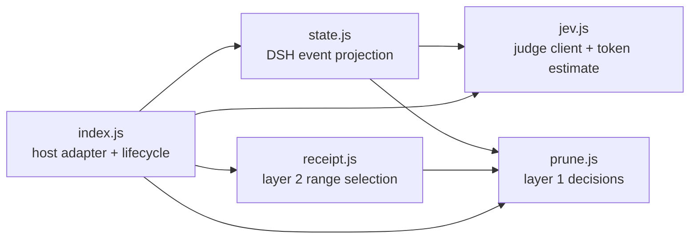

# Architecture

`dsh-jev-prune` adds two context-reduction layers to DeepSeek Harness while keeping DSH's event log as the source of truth.

## Modules

- `jev.js` owns the remote judge protocol, retry classification, batching, and local token estimation.
- `prune.js` contains layer-1 pure logic: cached-verdict lookup, pressure-budget planning, code-point-safe slicing, and DSH-compatible replacement events.
- `state.js` converts session events into the bounded state and questions sent to Jev. It also discovers tool names and selects candidates.
- `receipt.js` contains layer-2 pure logic: tool-pair balance checks, evidence guards, two-axis eligibility, contiguous range selection, and deterministic receipt rendering.
- `index.js` is the only host adapter. It resolves configuration, installs DSH hooks, owns per-session caches, invokes both layers, exposes tools/commands, and writes observability snapshots.

The dependency direction stays toward the pure modules. Host APIs must remain in `index.js`; moving them into `prune.js` or `receipt.js` would make the safety logic harder to test outside DSH.

## Runtime flow

1. A prepended `agent/pre-step` hook builds the current state and asks Jev only for missing verdict axes.
2. DSH's `compaction-basic` hook calls the synchronously overridden `toolResultPruner.pruneSession`. Layer 1 reads the verdict cache and replaces stale result bodies with head/marker/tail content.
3. The normal second plugin hook selects balanced, contiguous read-only ranges whose result and effect verdicts are both low.
4. `compactRegion` runs through the host engine. A one-use ownership token lets the temporary `summarize` override inject a deterministic receipt only for that transaction.
5. Original events remain in the session log. The surface points to replacement or compaction events, and `jev_restore` can retrieve the shadowed text.

## State and identity

Verdicts are held in a `WeakMap<session, Map<seq, verdict>>`. A layer-1 replacement receives a new seq and records the old seq in `sourceEventSeqs`; cache lookup follows that metadata so both layers keep the same judgment. In-memory verdicts are rebuilt after a process restart.

The pressure ratio is also session-scoped. `judgePass` computes it asynchronously, and the synchronous layer-1 override consumes it later in the same pre-step chain.

## Safety invariants

- Never split an unbalanced tool-call/result range.
- Never compact write-like tools; layer 2 uses a read-only allow-list plus a deny-list.
- Preserve recent surface nodes independently for each layer.
- Scan replacement source chains for error/assert/failure evidence.
- Fall back conservatively when the context window, event shape, or judge result is unavailable.
- Inject a receipt only when the active transaction owns the pending token.
- Keep deterministic receipts factual: tool, arguments, seq, and output size; no model-generated conclusion.

## Known boundary

One assistant message may contain several parallel tool calls. They share one head event, so the current contiguous-range API cannot remove only a subset of their results without breaking pairing. Issue #39 tracks the required atomic event-rewrite or host-level sub-step protocol.
