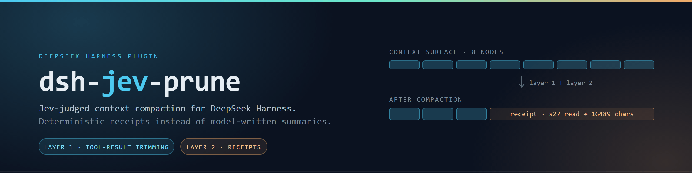
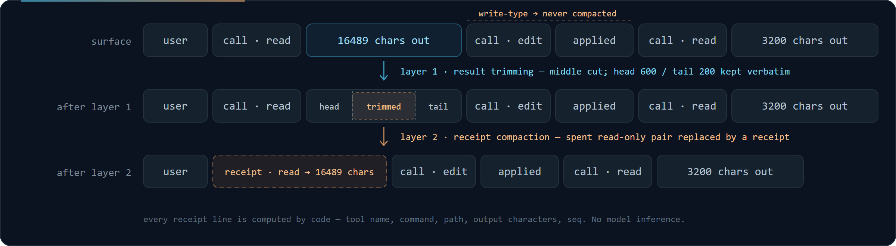

# dsh-jev-prune



**Jev-judged context compaction for DeepSeek Harness.**
用 [TypeSafe Jev](https://typesafe.ai) 的结构化判断驱动 [DeepSeek Harness](https://github.com/deepseek-ai/deepseek-harness)（DSH）的两层上下文压缩。压缩算法不改动，判断后端可插拔（Jev / 规则 / 自托管模型）。

[English](README.md) · **简体中文**

   [](https://github.com/yangyu666/dsh-jev-prune/actions/workflows/ci.yml) 

## 它解决什么问题

DSH 自带的上下文回收是**纯体积**的：工具结果超过阈值就掐中间留头尾；区域压缩则让模型**写一段摘要**顶替旧历史。前者不认识"这条很大但后面还要用"，后者会引入摘要幻觉。

本插件把这两处的判断都换成 Jev 的结构化输出（noul / choice，返回校准概率），并定了一条设计底线：

> **不该由模型生成的内容，就不让模型生成。** 裁剪只做留/删判断，原文逐字保留；区域压缩注入由代码生成的**确定性回执**，不含任何模型推断。

## 两层机制



| 层 | 接管点 | DSH 默认行为 | 本插件 |
|---|---|---|---|
| **1 · 结果裁剪** | `ctx.toolResultPruner.pruneSession` | 超过 `thresholdChars` 掐中间 | Jev 判定每个工具结果「接下来还要不要」，要的**再大也不裁**，过期的**再小也裁**（短于 `minCharsToPrune` 的除外）；无判定时退回 DSH 原生行为 |
| **2 · 回执压缩** | `ctx.compaction.summarize` + `compactRegion` | 模型读原历史、写摘要 | 把已花掉的只读探查（整对 `tool-call` + `tool/result`）移出 surface，注入**确定性回执**：工具名、命令、路径、字符数、seq 全由代码算出 |

第二层的回执长这样：

```
[已压缩 · 确定性回执] 原历史 s25–s27 是 1 次工具调用（共约 16489 字符输出），
为释放上下文已移出。以下为事实清单（代码生成，无模型推断）：
· s27 read：C:\Users\you\project\src\state.js → 16489 字符输出
原始事件仍完整保存在会话日志中（seqs 25–27）。需要内容时重跑相同命令/读取相同文件即可。
```

## 门控（第二层）

整对移出是破坏性动作，默认非常保守，需同时满足：

- **两轴判定取交集**：`result`（内容是否还需要）与 `effect`（调用是否改变了会话外状态）各自落在本次会话的尾部 `compactQuantile` 分位内
- 工具不在 `neverCompactTools`（改写类调用按硬规则永不移出）
- **证据守卫**：结果命中 `error` / `assert` / `fail` / `todo` 等词不移出（仍可被第一层截断）
- assistant 消息的**可见文本**超过 `maxStepTextChars`、或**思考草稿**（`reasoning`）超过 `maxStepReasoningChars` 的步骤不移出。两者**分开统计**：text 长说明这一步在交代结论（该守），reasoning 长只是模型草稿写得多（不代表有承重信息）。合并成一个预算时，光靠 reasoning 长度就能把第二层静默关掉
- 落在最近 `preserveRecent` 个节点内不移出
- 区间两端满足 DSH 的工具配对平衡；整段至少能省 `compactMinChars` 字符；回执 token 低于原内容的 `receiptMaxRatio`

概率的使用方式是**相对分位**而不是固定阈值：判断型小模型的输出分布很窄，只有同一会话内的相对排序携带稳定信息。

**小总体降级。** 只读工具在写/执行密集的会话里常常只占少数（实测只读 1/6），此时分位总体可能只有两三条——排序没有意义。这种情况**不是直接放弃**，而是降级为绝对下限模式：要求两轴**同时**低于 `floorThreshold`（默认 `0.2`，比 `compactThreshold` 明显更严，用来补偿"没有相对信息"这个缺口）。若样本连 `minCandidatesForFloor`（默认 3）都不到，则仍然不做——一两条谈不上分布。降级发生时会在报告与心跳里给出说明，不会静默发生。

## 回执归属（fence）

第二层的注入路径是：插件算出回执 → 存进 `pendingReceipt` → 调 `compactRegion` → DSH 在内部回调 `summarize`，插件在那里把回执交出去。

问题在于 `compactRegion` 是**异步**的，而 `summarize` 的入参里**没有区间身份**——它不知道"这次回调属于哪一段压缩"。于是 `await` 期间若别处（例如 DSH 自己的自动压缩）也发起一次压缩，两边会共用同一个按 session 键的待用槽位：**别人那段被换成我们的回执，我们要压的那段反而用了模型摘要**。两边的历史都被改坏，而且都不报错。

修法是给每次压缩发一张**归属令牌**（fencing token），三重约束：

| 机制 | 作用 |
|---|---|
| 归属令牌 | 生产端 `fenceCounter` 自增、`activeFence` 记住"当前属于谁"；`summarize` 只在 `entry.fence === activeFence` 时注入 |
| 一次性领取 | `entry.claimed` 置位后不再交出，同一次压缩中 `summarize` 被多次调用也不会重复注入 |
| 归属校验 | `compactRegion` 返回后核对令牌；若已被抢走则记 `action.fenceLost = true`，**不谎报成功** |

`finally` 里只清理**自己**的令牌（原实现无条件 `delete(session)` 会把别人的待用回执一并清掉）。被抢的次数计入 `receiptFenceMisses`，非零时在状态报告里显式提示——此时该区间退回模型摘要，属于安全侧降级。

## 环境要求

- Node `^22.19.0 || >=24.0.0`
- `dsh`（`@deepseek-ai/dsh`），profile 中已加载 base bundle（`tool-result-pruner` 与 `compaction-basic` 默认包含）
- TypeSafe API key（`TYPESAFE_API_KEY` 环境变量）
- 运行时 peer 依赖：`@deepseek-ai/schemastery`、`@deepseek-ai/dsh-tools`（随宿主提供）
- 可选动态依赖：`@deepseek-ai/dsh-llm` 的 `freezeMessage`（缺失时退化为浅拷贝，插件照常工作）

**版本对齐**：`@deepseek-ai/dsh-tools` 的 peer 范围为 `^0.1.5-rc.2`——测试版本 `0.1.5-rc.2` 在 npm 的 `next` 标签上而非 `latest`，仓库内提交了 lockfile（devDependencies 钉住实测版本），`npm ci` 可精确复现测试条件。

**兼容性**：针对 `@deepseek-ai/dsh@0.1.5-rc.2` 测试。DSH 0.1.x 为预发布版本，事件形状与服务名在小版本间可能变动；升级 DSH 后请重跑 `npm run check` 与冒烟测试，并在真实会话里调用一次 `jev_probe_shapes` 校对字段。

## 安装

```bash
# 从本地目录安装（仓库目录名与包名一致：dsh-jev-prune）
dsh plugin --profile web add link:/绝对路径/dsh-jev-prune

# 确认已进入配置树
dsh --profile web --dump-config | grep jev-prune
```

机器上没有 pnpm 时，可用等价的手工接线（幂等）：

```bash
node wire_profile.mjs <DSH_HOME> <profile名>
```

## 配置

| 键 | 默认 | 说明 |
|---|---|---|
| `enabled` | `true` | 总开关 |
| `model` | `jev-latest` | 判断模型 |
| `keepThreshold` | `0.5` | 第一层：`P(保留)` ≥ 该值不裁 |
| `preserveRecent` | `4` | 最近 N 个 surface 节点两层都不碰 |
| `headChars` / `tailChars` | `600` / `200` | 第一层裁剪保留的头/尾字符数 |
| `minCharsToPrune` | `400` | 第一层：短于该长度不裁 |
| `judgeOn` / `softLimit` | `pressure` / `55%` | 第一层判定时机与压力线 |
| `compactReceipts` / `compactOn` | `true` / `pressure` | 第二层开关与压力线（`compactSoftLimit` 默认 70%） |
| `compactMode` | `relative` | `relative`（推荐）或 `absolute`（配 `compactThreshold`） |
| `compactQuantile` | `0.34` | 两轴各取尾部的比例，取交集 |
| `minCandidatesForRelative` | `4` | 相对分位的**最小总体规模**；低于它则降级为绝对下限模式（见下），**不是**直接放弃 |
| `floorThreshold` / `minCandidatesForFloor` | `0.2` / `3` | 降级模式用的绝对下限（明显严于 `compactThreshold`）与其最低样本量 |
| `neverCompactTools` | 改写类工具 | 第二层永不移出；比较时归一化（`Edit` 与 `edit` 等价） |
| `neverPruneTools` | `Write` / `NotebookEdit` | **第一层**永不移出。比上一行**窄**：第一层只截断（可逆、原文仍在日志里），所以差异型编辑工具（`Edit`/`ApplyPatch`…）的参数可以裁；第二层是整对移出，所以那批工具仍然全守 |
| `compactTools` | 只读工具集 | 白名单，**默认非空**（`DSH_READONLY_TOOLS`：`read`/`glob`/`grep`/`list`/`fetch`…，含 PowerShell 的 `getchilditem`/`selectstring` 等只读命令）；配成 `[]` 会**放宽**为只受黑名单约束——shell 调用也会被整对移出，属显式 opt-in 的不安全模式 |
| `evidenceGuard` / `evidencePatterns` | `true` / 内置词表 | 证据守卫 |
| `compactMinChars` / `receiptMaxRatio` | `2000` / `0.5` | 第二层经济性下限 |
| `maxCompactionsPerPass` | `3` | 一次 pass 最多做几次压缩事务。提到 3 是为了让大上下文在**一轮**里收敛，而不是靠多轮 pre-step 慢慢挤；设成 `1` 回到旧行为 |
| `judgeMaxRetries` / `judgeRetryBaseMs` | `2` / `300` | 判定请求的重试次数与退避基数（见下）；`0` 关闭重试 |
| `dryRun` | `false` | 两层只判定记账、不动手 |
| `heartbeatFile` | `''` | 状态落盘路径（宿主会吞掉插件日志，落盘是唯一的外部观测通道） |

### 判定请求的重试

一次网络抖动原本会让**整轮判定**作废——本次 pass 的所有候选都没有概率，两层随即静默不动。现在按失败类型区分处理：

| 失败类型 | 处理 |
|---|---|
| 网络异常 / 超时 | **重试**，指数退避（`300ms` → `600ms`，默认最多 2 次） |
| `429` / `5xx` | **重试**（服务端暂时不可用） |
| 其他 `4xx`（`401` 密钥错 / `400` 请求有问题） | **不重试**，立刻抛（重试只是浪费额度） |
| 响应缺 `answers` | **不重试**（换一次大概率还是坏响应） |
| 外部 `signal` 已 abort | **不重试**，且不发新请求（用户中断就该停） |

多个批次之间也做了容错：某个批失败不再让后续批次一起放弃，失败批数记入状态报告的 `失败批次 N 个`；只有**全部**批次都失败才当作整轮失败。

### token 估算的精度

`estimateTokens` 是启发式的（插件不打包 tokenizer），但常数不再靠直觉：用真实 BPE 对 22 组样本（英文散文/驼峰长词/JSON/Windows 与 Unix 路径/Git diff/中文/中英混合/代码块/日志/纯符号/十六进制/表格行/单字/空白）做过网格标定，目标取"拟合集 + 留出集"加权误差最小以防过拟合。

平均绝对偏差从 **20.5% 降到 10.7%**（留出集 20.5% → 14.4%），且**方向性**修正了：旧实现在纯英文上高估 **+37%**、Unix 路径 **+44%**，而两层的门都拿它做分子/分母，等于把门都收紧了；新实现整体偏置约 **−0.3%**。`npm run check` 里有一条硬断言（MAE ≤ 15%）加上一条方向性断言，手改常数而没重跑标定会立刻失败。

### 压力门的失败方向

两层的压力门**同向关闭**：解析不出上下文窗口、或拿不到 token 用量（meter 缺失/抛错），**都不动作**。

旧实现是不对称的——第二层解析不出阈值时不做，第一层却直接**穿透照做**；更隐蔽的是 meter 缺失时 `used` 恒为 `0`，于是 `0 < threshold` 永远成立，判定**每一轮都跑**，压力门等于不存在。对一个"省 Jev 调用钱"的门来说，"解析不出来就别花钱"才是安全方向。

### 越界配置的处理

所有数值配置都有合法区间，越界值**不会**被原样送进运行时：

- **经 `Config` schema 校验的路径**（宿主正常加载）→ 越界直接抛 `ValidationError`，响亮拒绝。
- **未经归一化的路径**（`cordis.patch.yml` 直接注入配置对象、冒烟测试构造的 `PLUGIN_CFG`）→ 由 `resolveConfig` 钳制：非法值回落到**默认值**（不是钳到边界，因为"改了多少"不可解释），并在状态报告与心跳里留下一条 `configWarnings` 记录。

举几个真实后果（都是修复前会**静默**发生的）：

| 配置 | 修复前后果 |
|---|---|
| `preserveRecent = -5` | `lastAllowed` 反而变大 → **最近区保护完全失效**（会去动正在进行的工具调用） |
| `maxStepTextChars = -1` | 每步都判为"文本过长" → **第二层永久静默失效** |
| `compactMinChars = -100` | 该门形同不存在 |
| `receiptMaxRatio = 5` | 回执比原文大 5 倍也放行（安全门失效） |
| `keepThreshold = 2` | 第一层全部裁剪（`prob >= 2` 恒假） |

`0` 在多数键上是**合法值**（如 `headChars = 0` 表示不留头、`preserveRecent = 0` 表示不保护最近区），不会被当成"没配"。

## 会话内使用

| 入口 | 用途 |
|---|---|
| `/jev` 命令、`jev_prune_status` 工具 | 两层账本：判定缓存、累计节省、接管状态、工具名索引 |
| `jev_prune_now` | 手动触发一次第一层裁剪 |
| `jev_compact_now`（支持 `dryRun`） | 手动触发一次第二层回执压缩，逐条列出每个门控的排除计数与回执全文 |
| `jev_restore` | 安全阀：取回某个 checkpoint 移出 surface 的原始文本（只读） |
| `jev_probe_shapes` | 打印真实事件形状与工具名解析结果，用于适配不同 DSH 版本 |

正常情况下两层都由上下文压力自动驱动，无需手动介入。

## 设计说明

- **只读概率，不读生成文本**：判断一律取结构化响应里的 `answers[id].noul`
- **state 带任务目标**：判断"还有用吗"本质是"相对于目标还有用吗"，state 头部显式携带最近的用户指令
- **结构判断交代码，语义判断交模型**：改写类调用必留、最近区必留由硬规则保证，不交给概率
- **shadow-price 协议逐字对齐** DSH 的 `compaction/prune` + `surfaceOp: replace`，纯消费者的 token 账本可直接复用
- **按 Unicode 码点切片**，不劈代理对；token 估算用逐词校正算法（中英文混合可用）

## 测试

```bash
npm install   # 拉取 peer 依赖（lockfile 已提交，CI 用 npm ci 精确复现）
npm run check # 纯函数自检：token 估算 / state 组装 / 候选筛选 / 两层裁决 / 打包完整性
```

冒烟测试（不依赖完整 DSH 依赖树，4 秒跑完）。注意：插件入口静态 import 两个 peer，
干净目录请先补装（报错里也有同样提示）：

```bash
npm install @deepseek-ai/schemastery @deepseek-ai/dsh-tools
cp {index,jev,state,prune,receipt}.js package.json <某目录>/node_modules/dsh-jev-prune/
cp smoke_apply.mjs <某目录>/ && cd <某目录>/ && node smoke_apply.mjs
```

测试脚本与辅助工具（`check.js` / `smoke_apply.mjs` / `inspect_session.mjs` / `verify_real_shapes.mjs` / `wire_profile.mjs`）都随 npm 包发布，装好的包内可直接 `npm run check`。CI（`.github/workflows/ci.yml`）跑两组作业：仅 peer 依赖的快速冒烟 + 完整 DSH 依赖树的集成验证。

覆盖：两个接入点的接管、两层完整裁决路径、append 协议、回执注入与**归属（fence）**、并发压缩竞态、门控分支（含反事实对照）、**文本/思考两轴分离**、**小总体降级**、**越界配置钳制**、**判定请求重试与批级容错**、**批次记账不重复**、**压力门同向关闭**、**token 标定精度**、**压缩配额**、**shell 类工具默认排除**（`pwsh Remove-Item` 回归用例）。

**测试边界**（哪些是 CI 真正验证过的）：纯函数逻辑、假 ctx 下的接管与 append 协议、以及 integration 作业里的"真实依赖树下模块可加载 + freezeMessage 可用"。**没有**被 CI 覆盖的：真实 DSH 宿主内的服务接管、rc 版本间的事件形状漂移——这些只能在真实会话里用 `jev_probe_shapes` 校对。

## 目录结构

```
├── index.js            # 插件入口：配置、两个接入点的接管、pre-step 编排、命令与工具
├── prune.js            # 第一层：按码点切片、逐节点裁决、shadow-price 协议
├── receipt.js          # 第二层：工具配对平衡、范围选择、证据守卫、回执渲染
├── state.js            # DSH 事件 → 判断 state：目标提取、两轴提问、事件形状探针
├── jev.js              # Jev 客户端（结构化 noul 批量接口）+ token 估算
├── check.js            # 纯函数自检
├── smoke_apply.mjs     # 冒烟测试（假 ctx 跑真实 apply）
├── wire_profile.mjs    # 无 pnpm 时的手工安装路径
├── inspect_session.mjs # 会话日志离线检查器（zstd 多帧 JSONL）
├── verify_real_shapes.mjs # 用真实会话日志离线回归工具名解析
├── assets/             # Banner 与示意图（SVG 源文件 + 渲染出的 PNG）
└── cordis.patch.yml    # 安装契约
```

## 隐私

插件会把会话历史文本（含文件路径、代码片段、命令输出）发送到 TypeSafe API 用于判断。处理敏感代码时请自行评估；如需数据不出机，可将判断后端替换为自托管模型（判断与压缩机制已解耦，替换点在 `jev.js` 与 `state.js`）。

## License

[MIT](LICENSE)

---

[English](README.md) · **简体中文**
